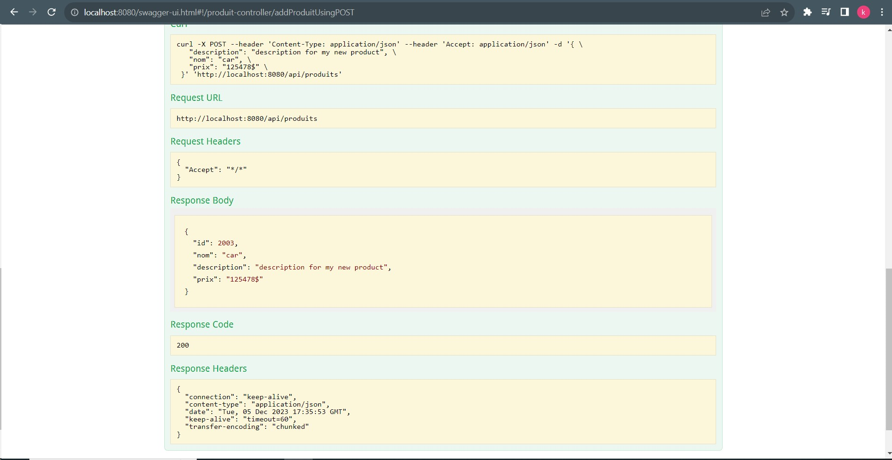

<h1>Réalisation d'une application API REST avec Spring Boot</h1>

<h3>Technologies utilisées </h3>
<ul>
    <li>Java 11</li>
    <li>Spring Boot</li>
    <li>Swagger UI</li>
</ul>

<h3>Structure de projet </h3>

ci-dessous , vous trouverez la console H2 ,inllustrant le contenu de la base de données après le chargement initial des données à partir du fichier CSV :

<h3>Tests avec Postman</h3>

Plus bas, vous découvrirez les tests réalisés avec l'outil Postman, incluant la récupération des objets au format JSON, l'ajout d'un objet en spécifiant des paramètres, ainsi que l'ajout d'un objet avec des valeurs aléatoires.

<h6>Récupération des objets au format json (API"GET")</h6>

<h6>Ajout d'un Objet avec Paramètres Fournis (API"POST")</h6>

<h6>Ajout d'un Objet avec Valeurs Aléatoires (API"POST")</h6>

<h1>Documentation via Swagger UI</h1>

<h6>Test (API 'GET')</h6>

<h6>Test (API 'POST')</h6>

<h6>Test (API'POST') avec des valeurs aléatoires</h6>

